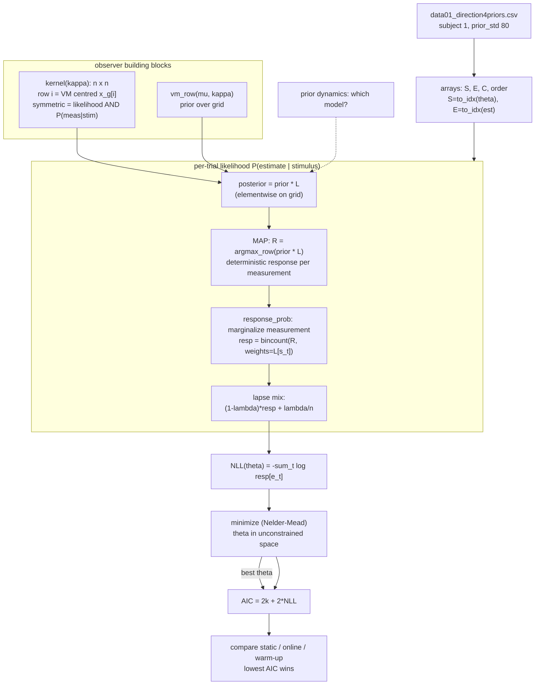
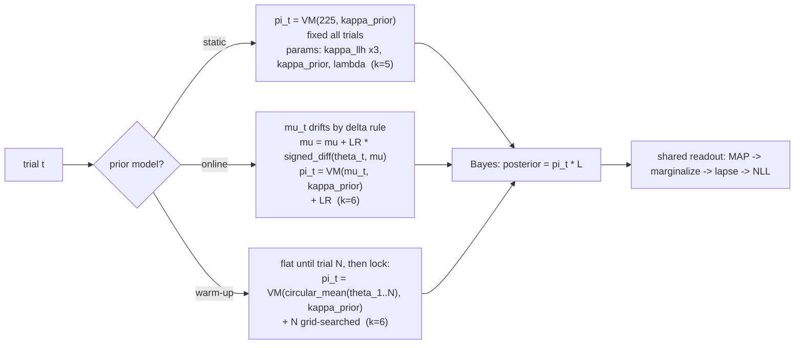
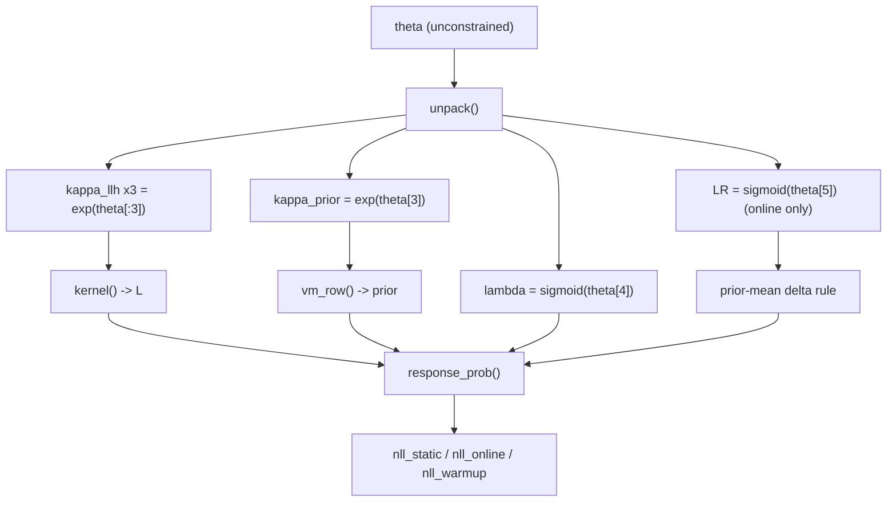

# Laquitaine fit — functional / mathematical flowchart

> Diagram twin of `projects/behavior_and_theory/earth_laquitaine_circular_fit_ext.ipynb` (von Mises) and its non-circular twin `earth_laquitaine_fit_ext.ipynb`.
> Companion to [`earth_laquitaine_gen_ext.md`](earth_laquitaine_gen_ext.md) (the generative Tutorial-2 version) and [`laquitaine_model_proposal.md`](laquitaine_model_proposal.md) (the full model space).

Reads the whole fit notebook as one function pipeline: **data → observer → per-trial likelihood → NLL → optimize → model comparison**. Node labels are compact; the exact math sits in the prose beside each stage.

---

## 0. Notation

Everything on a discrete direction grid $x_g = \{1, 5, \dots, 357\}°$ (`GRID_STEP=4`), $n$ points.

- Stimulus dir $\theta_t$ (index $s_t$), coherence $c_t \in \{0,1,2\}$, report $\hat\theta_t$ (index $e_t$), trial order $t$.
- Von Mises: $\mathrm{VM}(\theta;\mu,\kappa)\propto e^{\kappa\cos(\theta-\mu)}$, concentration $\kappa \approx 1/\sigma^2$.
- Prior mean fixed $\mu_0 = 225°$. Lapse $\lambda$.
- Gaussian twin: swap $\mathrm{VM}(\cdot,\kappa)\to \mathcal N(\cdot,\sigma)$, circular ops → linear.

---

## 1. Pipeline (data → AIC)



**Stage math.**

1. **Arrays.** $s_t=\mathrm{to\_idx}(\theta_t)$, $e_t=\mathrm{to\_idx}(\hat\theta_t)$, coherence bin $c_t$.
2. **Kernel.** $L^{(c)}_{ij}=\mathrm{VM}(x_g[j]; x_g[i], \kappa_{\text{llh}}(c))$, row-normalized. Symmetric ⇒ row $i$ (generative $P(m\mid \theta{=}i)$) equals column $i$ (likelihood over $\theta$ given $m{=}i$).
3. **Posterior + MAP.** For each possible measurement $m$: $\hat\theta(m)=\arg\max_\theta\ \pi(\theta)\,L_{m\theta}$, where $\pi$ = current prior.
4. **Marginalize** the unobserved $m$: $\;\mathrm{resp}[r]=\sum_{m:\hat\theta(m)=r} L_{s_t, m}$.
5. **Lapse floor:** $\;p(e\mid s)=(1-\lambda)\dfrac{\mathrm{resp}}{\sum \mathrm{resp}}+\dfrac{\lambda}{n}$.
6. **NLL:** $\;\mathcal L(\theta)=-\sum_t \log p(e_t\mid s_t)$; minimize; $\mathrm{AIC}=2k+2\mathcal L^\star$.

---

## 2. The one branch that defines the three models

Only **how the prior $\pi_t$ is formed each trial** differs. Everything downstream (Bayes → MAP → marginalize → NLL) is shared.



**Prior update rules.**

- **static:** $\pi_t = \mathrm{VM}(225°, \kappa_{\text{prior}})$, constant.
- **online (delta rule, no feedback → updates from the *stimulus*):**
$$\mu_{t+1} = \mu_t + \mathrm{LR}\cdot\big(\theta_t \ominus \mu_t\big),\qquad \pi_t=\mathrm{VM}(\mu_t,\kappa_{\text{prior}}).$$
- **warm-up:** flat prior for $t<N$, then fixed $\mu=\text{circmean}(\theta_{1..N})$.

Because prior-dynamics (this branch) is **orthogonal** to the distribution family (VM vs Gaussian), the Gaussian twin reuses this exact diagram with $\mathrm{VM}\to\mathcal N$, $\kappa\to\sigma$, $\ominus\to$ linear minus.

---

## 3. The core effect, in one equation

Why coherence controls the bias — the reason the whole fit exists. Prior weight in the posterior:

$$w_t \;=\; \frac{\kappa_{\text{prior}}}{\kappa_{\text{llh}}(c_t) + \kappa_{\text{prior}}}.$$

Low coherence ⇒ $\kappa_{\text{llh}}\downarrow$ ⇒ $w_t\uparrow$ ⇒ estimate pulled harder toward $225°$. `kappa_llh` sits in the denominator, which is why it is the most load-bearing fitted parameter. Gaussian twin: same with $\kappa\to 1/\sigma^2$, so $w_t = \dfrac{\sigma_{\text{llh}}^2}{\sigma_{\text{llh}}^2 + \sigma_{\text{prior}}^2}$.

---

## 4. Parameter → function dependency



Fit in unconstrained space, transform back: $\kappa=e^{\theta}$ (keeps positive), $\lambda,\mathrm{LR}=\mathrm{sigmoid}(\theta)$ (keeps in $[0,1]$).

---

## Colab links — all `earth_laquitaine` notebooks

Base: `https://colab.research.google.com/github/erdilix/nma-compneu2026/blob/main/projects/behavior_and_theory/<file>`

| rung | properties (circular · mode · scope) | notebook | Colab |
|---|---|---|---|
| 1 | linear · generative · extended | `earth_laquitaine_gen_ext.ipynb` | [open](https://colab.research.google.com/github/erdilix/nma-compneu2026/blob/main/projects/behavior_and_theory/earth_laquitaine_gen_ext.ipynb) |
| 2 | linear · fit · simple | `earth_laquitaine_fit_simple.ipynb` | [open](https://colab.research.google.com/github/erdilix/nma-compneu2026/blob/main/projects/behavior_and_theory/earth_laquitaine_fit_simple.ipynb) |
| 3 | circular · generative · simple | `earth_laquitaine_circular_gen_simple.ipynb` | [open](https://colab.research.google.com/github/erdilix/nma-compneu2026/blob/main/projects/behavior_and_theory/earth_laquitaine_circular_gen_simple.ipynb) |
| 4 | circular · fit · extended | `earth_laquitaine_circular_fit_ext.ipynb` | [open](https://colab.research.google.com/github/erdilix/nma-compneu2026/blob/main/projects/behavior_and_theory/earth_laquitaine_circular_fit_ext.ipynb) |
| — | linear · fit · extended *(off-ladder control)* | `earth_laquitaine_fit_ext.ipynb` | [open](https://colab.research.google.com/github/erdilix/nma-compneu2026/blob/main/projects/behavior_and_theory/earth_laquitaine_fit_ext.ipynb) |

Bare URLs:

```
https://colab.research.google.com/github/erdilix/nma-compneu2026/blob/main/projects/behavior_and_theory/earth_laquitaine_gen_ext.ipynb
https://colab.research.google.com/github/erdilix/nma-compneu2026/blob/main/projects/behavior_and_theory/earth_laquitaine_fit_simple.ipynb
https://colab.research.google.com/github/erdilix/nma-compneu2026/blob/main/projects/behavior_and_theory/earth_laquitaine_circular_gen_simple.ipynb
https://colab.research.google.com/github/erdilix/nma-compneu2026/blob/main/projects/behavior_and_theory/earth_laquitaine_circular_fit_ext.ipynb
https://colab.research.google.com/github/erdilix/nma-compneu2026/blob/main/projects/behavior_and_theory/earth_laquitaine_fit_ext.ipynb
```

> Colab renders from the `github/main` HEAD, so a link 404s until that notebook is pushed to `erdilix/nma-compneu2026:main`. All five above are pushed.

---

## Cross-refs

- Generative precursor (Tutorial 2, Gaussian, no fitting): [`earth_laquitaine_gen_ext.md`](earth_laquitaine_gen_ext.md).
- Full 2-axis model space + research questions: [`laquitaine_model_proposal.md`](laquitaine_model_proposal.md), [`laquitaine_research_questions.md`](laquitaine_research_questions.md).
- Notebooks: `earth_laquitaine_circular_fit_ext.ipynb` (von Mises), `earth_laquitaine_fit_ext.ipynb` (non-circular twin).
- Method lectures: **W3D2 Bayesian Decisions, Tutorial 3** (marginalize latent, fit) + **W1D2 Model Fitting** (NLL, recovery, AIC).
