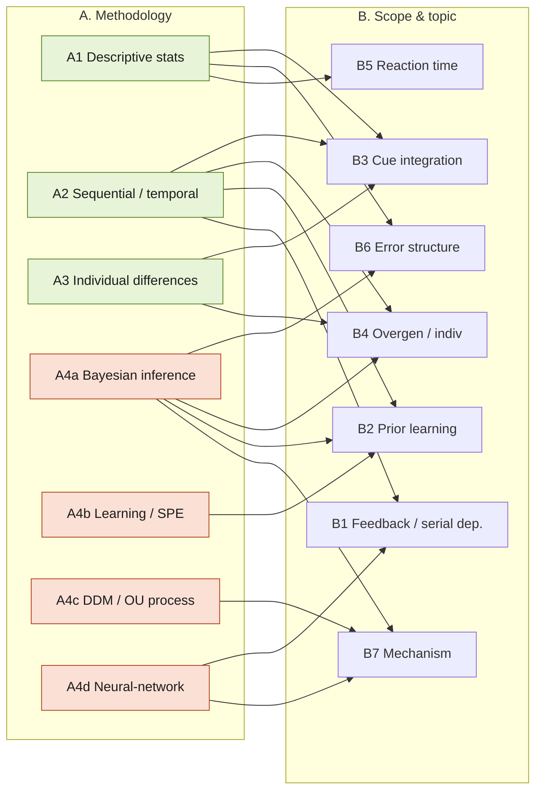

# Laquitaine Project — Research Questions, Grouped

Grouping of the candidate research questions for the two notebooks:

- **`laquitaine_human_errors.ipynb`** — real behavioral data, 12 subjects, motion-direction estimation. Key variables: `motion_direction`, `motion_coherence` (0.06 / 0.12 / 0.24), `prior_std` (10 / 20 / 40 / 80°, `prior_mean` fixed 225°), `estimate_x/y`, `reaction_time`, `session_id`, `run_id`. Prior changes block to block; block order is counterbalanced across subjects. Signed circular error = true direction − estimate.
- **`laquitaine_motion_prior_learning.ipynb`** — simulation. Delta-rule / Rescorla-Wagner **state prediction error (SPE)** learning of the generative prior, flat belief → true distribution over ~800 trials. Gaussian version + a Von Mises (circular) version.

Two independent lenses below: **(A) methodology** = what technique the question needs; **(B) scope & topic** = what phenomenon it is about. Most questions appear in one group per lens; overlaps are noted.

> **Data caveat:** in the loaded `data01_direction4priors.csv`, `reaction_time` and `raw_response_time` are `NaN` in the sample rows. Confirm RT is actually populated before committing to the RT questions (Q6, Q7); if sparse, they may need the full `.mat` dataset from Mendeley.

---

## Master map

| # | Short title | Methodology group (A) | Scope group (B) | Needs |
|---|-------------|----------------------|-----------------|-------|
| Q1 | Feedback-driven corrections (overall) | A2 Sequential | B1 Feedback/serial | Data |
| Q2 | Correction change across prior blocks | A2 Sequential | B1 Feedback/serial | Data |
| Q3 | Trial-to-trial feedback effect within block | A2 Sequential | B1 Feedback/serial | Data |
| Q4 | Who overgeneralizes less + factors | A3 Individual diff | B4 Overgen/indiv | Data |
| Q5 | Prior reliance: high vs low coherence | A3 Individual diff | B3 Cue integration | Data |
| Q6 | RT vs prior_std / coherence | A1 Descriptive | B5 Reaction time | Data (RT) |
| Q7 | Sensory evidence & prior effect on RT | A1 Descriptive | B5 Reaction time | Data (RT) |
| Q8 | Systematic within-subject error deviations (sign flips) | A1 Descriptive / A2 | B6 Error structure | Data |
| Q9 | Sensory evidence moderates prior effect on error | A1 Descriptive | B3 Cue integration | Data |
| Q10 | Ring / continuous attractor network model | A4d Neural network | B7 Mechanism | Model |
| Q11 | Drift-diffusion / OU on circular variable | A4c Process model | B7 Mechanism | Model (+data fit) |
| Q12 | PPC vs sampling account of variability | A4a Inference model | B7 Mechanism | Model (+data fit) |
| Q13 | Persistent activity + STP for serial dependence | A4d Neural network | B1 Feedback/serial | Model |
| Q14 | Strategy-switching dynamics (errors before switch) | A4a Inference model | B2 Prior learning | Model + data |
| Q15 | Per-subject hardest directions (blind-spot heatmap) | A1 Descriptive | B6 Error structure | Data |
| Q16 | Overgeneralization on transition to low coherence | A2 Sequential | B4 Overgen/indiv | Data |
| Q17 | Improvement at high coherence over time | A2 Sequential | B2 Prior learning | Data |
| Q18 | SPE model vs real learning | A4b Learning model | B2 Prior learning | Model + data |
| Q19 | Prior learning gradual vs abrupt (insight) | A2 / A4b | B2 Prior learning | Data (+model) |
| Q20 | Overgeneralization source: stimulus vs inference | A4a Inference model | B4 Overgen/indiv | Model + data |
| Q21 | Hierarchical Bayesian bimodality of errors | A4a Inference model | B6 Error structure | Model + data |
| Q22 | Low-evidence streaks increase prior reliance | A2 Sequential | B3 Cue integration | Data |

---

## A. Grouped by research methodology

### A1 — Descriptive behavioral statistics (existing data, no model)
Correlation / regression / visualization on the recorded data.
- **Q6** RT vs `prior_std` and `motion_coherence`.
- **Q7** Sensory evidence + prior effect on RT (IV1 motion direction/prior, IV2 coherence; DV response/reaction time).
- **Q8** Locate and characterize systematic within-subject error deviations (e.g. session-5, 20° prior, high-coh error flipping sign mid-session). *(also touches A2)*
- **Q9** Does coherence moderate the prior→error relationship (interaction term).
- **Q15** Per-subject "blind spots": which motion directions are hardest, at high coherence — heatmap-style.

### A2 — Temporal / sequential analysis (learning curves, serial dependence, change-point)
Trial-order matters; analyze across or within blocks over time.
- **Q1** Are corrections feedback-driven at all.
- **Q2** Between-block: does the correction pattern shift right after a new prior is introduced.
- **Q3** Within-block serial dependence: does trial *t−1* feedback shift estimate at *t*.
- **Q16** On transition to lower coherence (new angles): do subjects overgeneralize; how to quantify.
- **Q17** At high coherence, does prediction error shrink over time (getting better).
- **Q19** Is prior learning gradual/linear or an abrupt change-point ("insight"). *(also A4b)*
- **Q22** Do runs of low-evidence trials increase reliance on the prior.

### A3 — Individual-differences analysis (across / between subjects)
- **Q4** Which subjects overgeneralize less, and what factors predict it.
- **Q5** Do subjects who lean on the prior at high coherence also do so at low coherence (within-subject consistency of prior reliance across reliability).

### A4 — Computational modeling
- **A4a Normative / Bayesian inference models**
  - **Q12** Trial-to-trial variability: probabilistic population coding (PPC) vs sampling account.
  - **Q14** Strategy-switching dynamics: how many errors before switching mode under a Bayesian criterion.
  - **Q20** Overgeneralization source — stimulus (prior + likelihood) vs subject inference/interpretation vs both.
  - **Q21** Hierarchical Bayesian model where stimulus explains errors in some trials (high coh) and inference in others — can it reproduce the observed error bimodality.
- **A4b Learning (RL / delta-rule) models** — directly extends the SPE notebook
  - **Q18** Compare simulated SPE learning to real subjects' learning.
  - **Q19** Gradual vs abrupt learning (fit linear vs nonlinear/step learning curve). *(also A2)*
- **A4c Dynamical-systems / process models**
  - **Q11** Drift-diffusion / Ornstein-Uhlenbeck process on a circular variable: restoring force toward prior mean, drift set by coherence.
- **A4d Mechanistic neural-network models**
  - **Q10** Ring / continuous attractor network with prior-tuned recurrent connectivity + coherence-tuned input gain → reproduce empirical bias-variance patterns.
  - **Q13** Persistent activity + short-term synaptic plasticity to account for serial dependence.

---

## B. Grouped by scope & underlying topic

### B1 — Feedback-driven correction & serial dependence
Does past feedback change the next estimate?
- **Q1** corrections feedback-driven, **Q2** across prior blocks, **Q3** within block (trial *t−1* → *t*), **Q13** neural mechanism (persistent activity + STP).

### B2 — Prior learning dynamics
How the prior is acquired and represented over trials.
- **Q17** improvement at high coherence, **Q18** SPE model vs data, **Q19** gradual vs abrupt, **Q14** switching under Bayesian criterion.

### B3 — Prior–likelihood integration / cue reliability
How the weighting between prior and sensory evidence adapts to reliability.
- **Q5** prior reliance high vs low coherence, **Q9** coherence moderates prior effect on error, **Q22** low-evidence streaks increase prior reliance, **Q20** stimulus vs inference source *(shared with B4)*.

### B4 — Overgeneralization & individual differences
Who over-applies the prior, when, and why.
- **Q4** who overgeneralizes less + factors, **Q15** per-subject blind spots, **Q16** overgeneralization on coherence transition, **Q20** source of overgeneralization, **Q21** bimodality of errors *(shared with B6)*.

### B5 — Reaction time / decision effort
- **Q6** RT vs prior_std/coherence, **Q7** sensory evidence + prior → RT.

### B6 — Systematic error structure & bias patterns
The shape/geometry of the errors themselves.
- **Q8** systematic within-subject deviations (sign flips), **Q15** direction-specific blind spots, **Q21** bimodal error distribution.

### B7 — Mechanistic model of the estimation process
Candidate generative mechanisms for the whole bias–variance pattern.
- **Q10** attractor network, **Q11** DDM/OU on circle, **Q12** PPC vs sampling, **Q13** persistent activity + STP *(shared with B1)*.

---

## Diagram — the two lenses over the questions

Green = data-only methods (reuse existing notebook tooling). Orange = new modeling effort. Edges show which topic each method feeds.

## Reading the two lenses together

- **Cheapest, do-first (data-only, existing notebook tools):** B5 (Q6/Q7, pending RT availability), B6 descriptive (Q8, Q15), B3 descriptive (Q9), B1/B2 sequential (Q1, Q2, Q3, Q17, Q22), individual differences (Q4, Q5). All reuse the circular-stats + `plot_mean` machinery already in `laquitaine_human_errors.ipynb`.
- **Extends the existing SPE simulation directly:** Q18, Q19 (and Q14) — build on `learn_generative_process` / Von Mises cells in `laquitaine_motion_prior_learning.ipynb`.
- **New modeling effort (highest lift):** A4c/A4d/A4a mechanistic models — Q10, Q11, Q12, Q13, Q20, Q21. These deliver mechanism but need model code + fitting beyond the current notebooks.
