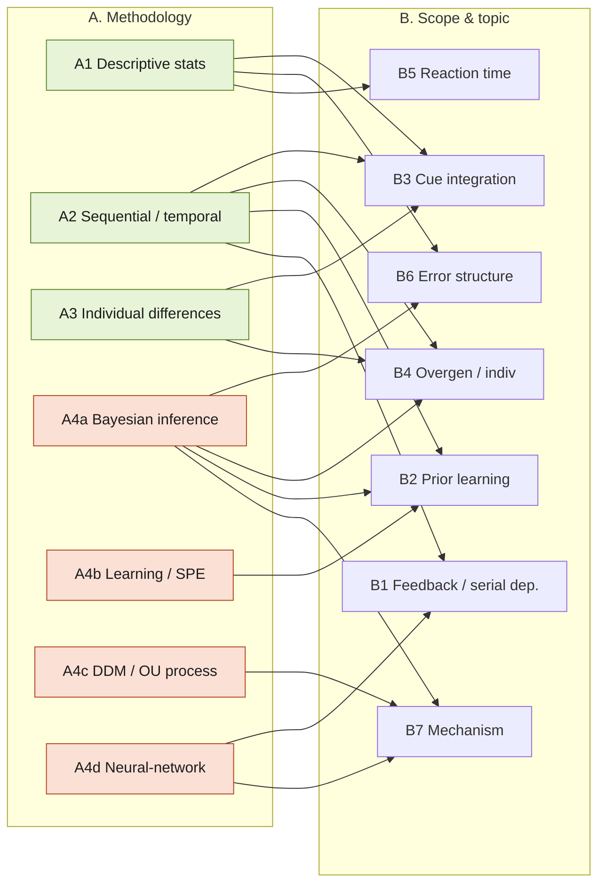

# Laquitaine Project — Research Questions, Grouped

Grouping of the candidate research questions for the two notebooks:

- **`laquitaine_human_errors.ipynb`** — real behavioral data, 12 subjects, motion-direction estimation. Key variables: `motion_direction`, `motion_coherence` (0.06 / 0.12 / 0.24), `prior_std` (10 / 20 / 40 / 80°, `prior_mean` fixed 225°), `estimate_x/y`, `reaction_time`, `session_id`, `run_id`. Prior changes block to block; block order is counterbalanced across subjects. Signed circular error = true direction − estimate.
- **`laquitaine_motion_prior_learning.ipynb`** — simulation. Delta-rule / Rescorla-Wagner **state prediction error (SPE)** learning of the generative prior, flat belief → true distribution over ~800 trials. Gaussian version + a Von Mises (circular) version.

Two independent lenses below: **(A) methodology** = what technique the question needs; **(B) scope & topic** = what phenomenon it is about. Most questions appear in one group per lens; overlaps are noted.

Numbering is a nested outline: a parent topic that carries sub-questions is `N`, its sub-questions `Na`, `Nb`. Topics **1, 3, 4, 12** carry subtopics; the rest are standalone.

> **Data caveat:** in the loaded `data01_direction4priors.csv`, `reaction_time` and `raw_response_time` are `NaN` in the sample rows. Confirm RT is actually populated before committing to the RT questions (3a, 3b); if sparse, they may need the full `.mat` dataset from Mendeley.

---

## The questions (nested outline)

1. **Corrections driven by feedback?** [~template Q1, Q5, Q6] Are participants making corrections that are driven by feedback?
   - **1a.** *Between blocks (different priors):* prior order differs per participant; every prior change means learning a new distribution. Can we observe the change in corrections before vs after a new prior is implemented?
   - **1b.** *Within block (same prior):* does the previous trial's feedback (relevant to the estimate) affect the estimate on the following trial?
2. **Who overgeneralizes less?** [~template Q7] Which subjects behave in a less overgeneralized way, and what factors explain it?
3. **Across subjects — prior reliance:** do those who rely more on the prior at high coherence also do so at low coherence?
   - **3a.** How is reaction time associated with `prior_std` / `motion_coherence`?
   - **3b.** Do sensory evidence and prior affect reaction time? (IV1: motion direction / prior; IV2: motion coherence; DV: response/reaction time.)
4. **Systematic within-subject error deviations** [~template Q1]: some sessions show systematic deviations (e.g. subject 1, high coherence 0.24; 20° prior, session 5 — errors flip from continuously one direction to continuously another). What causes this?
   - **4a.** Are there moderation effects of sensory evidence on the prior's effect on estimation error?
   - **4b.** Can a ring / continuous-attractor network (prior-tuned recurrent connectivity + coherence-tuned input gain) reproduce the empirical bias–variance patterns?
5. **Drift-diffusion / OU process:** can estimation be modeled as a drift-diffusion (or Ornstein-Uhlenbeck-like) process on a circular variable — restoring force toward the prior mean, drift driven by coherence?
6. **PPC vs sampling:** do trial-to-trial variability statistics better match probabilistic population coding (PPC) or a sampling-based account of uncertainty?
7. **Persistent activity + STP:** can persistent neural activity with short-term synaptic plasticity account for observed serial-dependence effects?
8. **Strategy-switching dynamics:** how many errors must occur before switching to another mode under a Bayesian criterion?
9. **Per-subject blind spots** (within-subject, high coherence): which motion directions are systematically hardest for each individual (AimLab-style heatmap), and how do we extract this?
10. **Coherence transition:** when transitioning to lower coherence with different angles, do subjects overgeneralize, and how do we measure it?
11. **Improvement at high coherence:** do subjects get better at identifying the correct direction over time (less prediction error)?
12. **Prior learning & the SPE model** [~template Q9]: how do participants learn the prior, and does the SPE model in `laquitaine_motion_prior_learning.ipynb` capture it (simulated SPE vs real data)?
    - **12a.** Is prior learning gradual/linear, or abrupt and nonlinear ("insight-like")?
13. **Source of overgeneralization** [extends Q7]: does overgeneralization derive from the stimulus (prior + likelihood), from the subject's inference/interpretation, or both?
14. **Hierarchical Bayesian bimodality** [~Q8, extends 10 & 13]: simulate a hierarchical Bayesian model where the stimulus explains errors on some trials (high coherence) and subject inference on others — can it reproduce the observed error bimodality?
15. **Low-evidence streaks:** do sequences of low sensory evidence increase reliance on the prior?

---

## Master map

| # | Short title | Methodology group (A) | Scope group (B) | Needs |
|---|-------------|----------------------|-----------------|-------|
| 1 | Feedback-driven corrections (overall) | A2 Sequential | B1 Feedback/serial | Data |
| 1a | Correction change across prior blocks | A2 Sequential | B1 Feedback/serial | Data |
| 1b | Trial-to-trial feedback effect within block | A2 Sequential | B1 Feedback/serial | Data |
| 2 | Who overgeneralizes less + factors | A3 Individual diff | B4 Overgen/indiv | Data |
| 3 | Prior reliance: high vs low coherence | A3 Individual diff | B3 Cue integration | Data |
| 3a | RT vs prior_std / coherence | A1 Descriptive | B5 Reaction time | Data (RT) |
| 3b | Sensory evidence & prior effect on RT | A1 Descriptive | B5 Reaction time | Data (RT) |
| 4 | Systematic within-subject error deviations (sign flips) | A1 Descriptive / A2 | B6 Error structure | Data |
| 4a | Sensory evidence moderates prior effect on error | A1 Descriptive | B3 Cue integration | Data |
| 4b | Ring / continuous attractor network model | A4d Neural network | B7 Mechanism | Model |
| 5 | Drift-diffusion / OU on circular variable | A4c Process model | B7 Mechanism | Model (+data fit) |
| 6 | PPC vs sampling account of variability | A4a Inference model | B7 Mechanism | Model (+data fit) |
| 7 | Persistent activity + STP for serial dependence | A4d Neural network | B1 Feedback/serial | Model |
| 8 | Strategy-switching dynamics (errors before switch) | A4a Inference model | B2 Prior learning | Model + data |
| 9 | Per-subject hardest directions (blind-spot heatmap) | A1 Descriptive | B6 Error structure | Data |
| 10 | Overgeneralization on transition to low coherence | A2 Sequential | B4 Overgen/indiv | Data |
| 11 | Improvement at high coherence over time | A2 Sequential | B2 Prior learning | Data |
| 12 | SPE model vs real learning | A4b Learning model | B2 Prior learning | Model + data |
| 12a | Prior learning gradual vs abrupt (insight) | A2 / A4b | B2 Prior learning | Data (+model) |
| 13 | Overgeneralization source: stimulus vs inference | A4a Inference model | B4 Overgen/indiv | Model + data |
| 14 | Hierarchical Bayesian bimodality of errors | A4a Inference model | B6 Error structure | Model + data |
| 15 | Low-evidence streaks increase prior reliance | A2 Sequential | B3 Cue integration | Data |

---

## A. Grouped by research methodology

### A1 — Descriptive behavioral statistics (existing data, no model)
Correlation / regression / visualization on the recorded data.
- **3a** RT vs `prior_std` and `motion_coherence`.
- **3b** Sensory evidence + prior effect on RT (IV1 motion direction/prior, IV2 coherence; DV response/reaction time).
- **4** Locate and characterize systematic within-subject error deviations (session-5, 20° prior, high-coh error flipping sign mid-session). *(also touches A2)*
- **4a** Does coherence moderate the prior→error relationship (interaction term).
- **9** Per-subject "blind spots": which motion directions are hardest, at high coherence — heatmap-style.

### A2 — Temporal / sequential analysis (learning curves, serial dependence, change-point)
Trial-order matters; analyze across or within blocks over time.
- **1** Are corrections feedback-driven at all.
- **1a** Between-block: does the correction pattern shift right after a new prior is introduced.
- **1b** Within-block serial dependence: does trial *t−1* feedback shift estimate at *t*.
- **10** On transition to lower coherence (new angles): do subjects overgeneralize; how to quantify.
- **11** At high coherence, does prediction error shrink over time (getting better).
- **12a** Is prior learning gradual/linear or an abrupt change-point ("insight"). *(also A4b)*
- **15** Do runs of low-evidence trials increase reliance on the prior.

### A3 — Individual-differences analysis (across / between subjects)
- **2** Which subjects overgeneralize less, and what factors predict it.
- **3** Do subjects who lean on the prior at high coherence also do so at low coherence (within-subject consistency of prior reliance across reliability).

### A4 — Computational modeling
- **A4a Normative / Bayesian inference models**
  - **6** Trial-to-trial variability: probabilistic population coding (PPC) vs sampling account.
  - **8** Strategy-switching dynamics: how many errors before switching mode under a Bayesian criterion.
  - **13** Overgeneralization source — stimulus (prior + likelihood) vs subject inference/interpretation vs both.
  - **14** Hierarchical Bayesian model where stimulus explains errors in some trials (high coh) and inference in others — can it reproduce the observed error bimodality.
- **A4b Learning (RL / delta-rule) models** — directly extends the SPE notebook
  - **12** Compare simulated SPE learning to real subjects' learning.
  - **12a** Gradual vs abrupt learning (fit linear vs nonlinear/step learning curve). *(also A2)*
- **A4c Dynamical-systems / process models**
  - **5** Drift-diffusion / Ornstein-Uhlenbeck process on a circular variable: restoring force toward prior mean, drift set by coherence.
- **A4d Mechanistic neural-network models**
  - **4b** Ring / continuous attractor network with prior-tuned recurrent connectivity + coherence-tuned input gain → reproduce empirical bias-variance patterns.
  - **7** Persistent activity + short-term synaptic plasticity to account for serial dependence.

---

## B. Grouped by scope & underlying topic

### B1 — Feedback-driven correction & serial dependence
Does past feedback change the next estimate?
- **1** corrections feedback-driven, **1a** across prior blocks, **1b** within block (trial *t−1* → *t*), **7** neural mechanism (persistent activity + STP).

### B2 — Prior learning dynamics
How the prior is acquired and represented over trials.
- **11** improvement at high coherence, **12** SPE model vs data, **12a** gradual vs abrupt, **8** switching under Bayesian criterion.

### B3 — Prior–likelihood integration / cue reliability
How the weighting between prior and sensory evidence adapts to reliability.
- **3** prior reliance high vs low coherence, **4a** coherence moderates prior effect on error, **15** low-evidence streaks increase prior reliance, **13** stimulus vs inference source *(shared with B4)*.

### B4 — Overgeneralization & individual differences
Who over-applies the prior, when, and why.
- **2** who overgeneralizes less + factors, **9** per-subject blind spots, **10** overgeneralization on coherence transition, **13** source of overgeneralization, **14** bimodality of errors *(shared with B6)*.

### B5 — Reaction time / decision effort
- **3a** RT vs prior_std/coherence, **3b** sensory evidence + prior → RT.

### B6 — Systematic error structure & bias patterns
The shape/geometry of the errors themselves.
- **4** systematic within-subject deviations (sign flips), **9** direction-specific blind spots, **14** bimodal error distribution.

### B7 — Mechanistic model of the estimation process
Candidate generative mechanisms for the whole bias–variance pattern.
- **4b** attractor network, **5** DDM/OU on circle, **6** PPC vs sampling, **7** persistent activity + STP *(shared with B1)*.

---

## Diagram — the two lenses over the questions

Green = data-only methods (reuse existing notebook tooling). Orange = new modeling effort. Edges show which topic each method feeds.

## Reading the two lenses together

- **Cheapest, do-first (data-only, existing notebook tools):** B5 (3a/3b, pending RT availability), B6 descriptive (4, 9), B3 descriptive (4a), B1/B2 sequential (1, 1a, 1b, 11, 15), individual differences (2, 3). All reuse the circular-stats + `plot_mean` machinery already in `laquitaine_human_errors.ipynb`.
- **Extends the existing SPE simulation directly:** 12, 12a (and 8) — build on `learn_generative_process` / Von Mises cells in `laquitaine_motion_prior_learning.ipynb`.
- **New modeling effort (highest lift):** A4c/A4d/A4a mechanistic models — 4b, 5, 6, 7, 13, 14. These deliver mechanism but need model code + fitting beyond the current notebooks.
