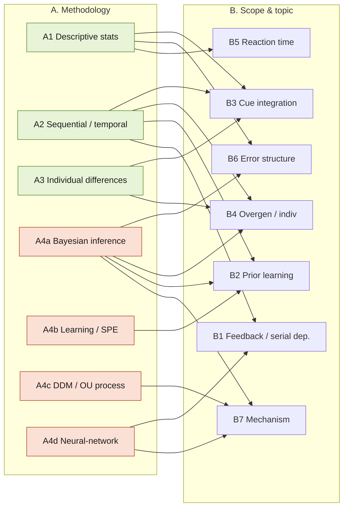

# Laquitaine Project — Research Questions, Grouped

Grouping of the candidate research questions for the two notebooks. Numbering follows the source doc `NMA - Project Laquitaine.md`.

- **`laquitaine_human_errors.ipynb`** — real behavioral data, 12 subjects, motion-direction estimation. Key variables: `motion_direction`, `motion_coherence` (0.06 / 0.12 / 0.24), `prior_std` (10 / 20 / 40 / 80°, `prior_mean` fixed 225°), `estimate_x/y`, `reaction_time`, `session_id`, `run_id`. Prior changes block to block; block order is counterbalanced across subjects. Signed circular error = true direction − estimate.
- **`laquitaine_motion_prior_learning.ipynb`** — simulation. Delta-rule / Rescorla-Wagner **state prediction error (SPE)** learning of the generative prior, flat belief → true distribution over ~800 trials. Gaussian version + a Von Mises (circular) version.

Two independent lenses below: **(A) methodology** = what technique the question needs; **(B) scope & topic** = what phenomenon it is about. Most questions appear in one group per lens; overlaps are noted. Topics **1, 3, 4, 12** carry subtopics.

> **Data note (from source EDA):** `reaction_time` is populated for 51,358 of 83,213 trials (mean 1.35 s, std 0.43; one negative outlier ≈ −0.018 s), so the RT questions (4, 3b) are feasible — the `NaN`s in the notebook's CSV head are not representative of the whole column. `estimate_x/y`, `raw_response_time`, `response_arrow_start_angle` also contain some `NaN`.

---

## The questions (source order)

1. **Corrections driven by feedback?** [~template Q1, Q5, Q6] Are participants making corrections that are driven by feedback?
   - **1a.** *Between blocks (different priors):* prior order differs per participant; every prior change means learning a new distribution. Can we observe the change in corrections before vs after a new prior is implemented?
   - **1b.** *Within block (same prior):* does the previous trial's feedback (relevant to the estimate) affect the estimate on the following trial?
2. **Who overgeneralizes less?** [mirrors Q7] Which subjects behave in a less overgeneralized way, and what factors explain it?
3. **Across subjects:**
   - **3a.** Do those who rely more on the prior at high coherence also do so at low coherence?
   - **3b.** How is reaction time associated with `prior_std` / `motion_coherence`?
4. **Do sensory evidence and prior affect reaction time to stimuli?**
   - **4a.** IV1: motion direction (prior); IV2: motion coherence.
   - **4b.** DV: reaction time.
5. **Systematic within-subject error deviations** [~template Q1]: some sessions show systematic deviations (last session of the notebook; all sessions at high coherence 0.24 for subject 1; e.g. 20° prior, session 5 — errors transition from continuously one direction to continuously another). What causes this?
6. **Moderation effects:** are there moderation effects of sensory evidence on the prior's effect on estimation error?
7. **Ring / continuous-attractor network:** can a ring / continuous-attractor network (prior-tuned recurrent connectivity + coherence-tuned input gain) reproduce the empirical bias–variance patterns across conditions?
8. **Drift-diffusion / OU process:** can estimation be modeled as a drift-diffusion (or Ornstein-Uhlenbeck-like) process on a circular variable — restoring force toward the prior mean, drift driven by motion coherence?
9. **PPC vs sampling:** do trial-to-trial variability statistics better match a probabilistic population coding (PPC) account or a sampling-based account of uncertainty?
10. **Persistent activity + STP:** can persistent neural activity with short-term synaptic plasticity account for any observed serial-dependence effects?
11. **Strategy-switching dynamics:** how many errors must occur before switching to another mode under a Bayesian criterion?
12. **Per-subject blind spots** (within-subject, high coherence): which motion directions are systematically hardest for each individual (AimLab-style heatmap), and how do we extract this?
    - **12a.** When transitioning to lower coherence with different angles: do they overgeneralize? How can we measure this?
13. **Improvement at high coherence:** do subjects get better at identifying the correct direction over time (less prediction error)?
14. **Prior learning & the SPE model** [~template Q9]: how do participants learn the prior, and does the SPE model in `laquitaine_motion_prior_learning.ipynb` capture it (simulated SPE vs real data)?
15. **Gradual vs abrupt learning:** is prior learning gradual/linear, or does it occur abruptly in a nonlinear "insight-like" fashion?
16. **Source of overgeneralization** [extends Q7]: does overgeneralization derive from the stimulus (motion-direction prior + sensory-evidence likelihood), from the subject's inference/interpretation, or both?
17. **Hierarchical Bayesian bimodality** [~Q8, extends 16]: simulate a hierarchical Bayesian model where the stimulus explains errors on some trials (high coherence) and subject inference on others — can it reproduce the observed error bimodality?
18. **Low-evidence streaks:** do sequences of low sensory evidence increase reliance on the prior?

---

## Candidate model assumptions (source: "Research Proposal")

Nineteen assumptions from the source doc. Most are competing **prior-updating rules** — hypotheses about how the prior belief evolves trial to trial. They are the model space the modeling questions (11, 14–17) draw from. Grouped by what they specify.

> **Turned into math:** see [`laquitaine_model_proposal.md`](laquitaine_model_proposal.md) — the 19 collapse to one circular Bayesian observer along two orthogonal axes (prior-dynamics core × readout mode) plus overlay params; each assumption below is one setting of that model.

### M-a — Prior-updating rule (how the prior evolves over trials)
- **A1** *Online Bayesian (serial-dependence):* subject updates prior every trial from feedback; prior keeps evolving all block.
- **A2** *Static Bayesian:* learns prior fast (within N trials), then holds it fixed for the block.
- **A3** *SPE (state prediction error):* learning rate modulated by prediction error — bigger estimate-vs-actual discrepancy = faster prior update. (this is the notebook's delta-rule model)
- **A6** *Sliding average:* trial's prior = plain mean of previous 5 trials.
- **A7** *Exponentially-weighted:* trial's prior = exp-weighted previous 5 trials.
- **A8** *Fixed:* trial's prior = overall average prior (block-level std/mean), constant.
- **A9** *Mixture:* trial's prior = weighted average of exp-weighted previous N trials and the overall average prior.
- **A11** *Cumulative:* learned from all past trials (running average).

### M-b — Architecture / strategy
- **A4** *Switching observer:* each trial uses either prior OR sensory evidence (picked with probability set by relative strengths), not a multiplicative posterior. Produces bimodal errors.
- **A5** *Hierarchical Bayesian (two-level):* infers both motion direction AND which prior is in play (uniform vs peaked/von Mises), switching on evidence.
- **A12** *Hierarchical dynamic:* learns prior by updating belief across trials, with higher-level params constraining how fast/flexibly learning occurs.

### M-c — Learning-rate & condition dependence
- **A14** *Latent prior-variance:* subject doesn't grab block prior width immediately; holds latent prior-variance estimate, updates it each feedback, gradually approaches true block width.
- **A15** *Shared mechanism:* same updating mechanism in narrow- and wide-prior conditions; learning-rate param may differ by condition.
- **A16** *Partial carryover:* subject partly carries prior estimate from preceding block rather than fully resetting at each block transition.
- **A17** *Timing:* prior updates at moment of last feedback; prior biases take effect only after extensive experience.
- **A18** *Width→rate:* narrow prior = faster learning rate, wide prior = slower.
- **A19** *Evidence×width:* sensory evidence disturbs learning rate in wide-prior condition, weaker effect in narrow-prior.

### M-d — Measurement / readout
- **A13** *Perception-equals-report:* reported estimate faithfully reflects perceptual inference that trial — no separate decision/report stage; so unimodal-vs-bimodal estimate shape reflects the perceptual computation, not downstream choice.
- **A10** *RT-as-signal:* slope of reaction time over previous 5 trials predicts next trial's prediction error as the subject learns the prior (x = trial, y = RT).

**Assumption → question links:** A1/A6/A7/A9/A11 (evolving prior) ↔ Q1/1b, Q18, Q14. A2/A8 (fixed) ↔ null baselines for Q13/Q15. A3 (SPE) ↔ Q14. A4/A5/A12 (switching/hierarchical) ↔ Q11, Q16, Q17. A14/A16/A17/A18/A19 (learning-rate dynamics) ↔ Q13, Q15, Q3a, Q6, Q18. A13 (readout) is a global caveat for every error-shape claim (Q5, Q12, Q17). A10 (RT slope) ↔ Q3b, Q4.

---

## Variables & manipulations (EDA reference)

Single experiment: `experiment_name = data01_direction4priors`. 83,213 trials total.

**Manipulations (independent variables):**
- **Motion coherence** (sensory evidence): 0.06 / 0.12 / 0.24 (i.e. 6% / 12% / 24% dot coherence).
- **Motion direction** = the prior: `prior_std` ∈ {10, 20, 40, 80}° with `prior_mean` fixed at **225°**. Displayed direction sampled per trial from that generative distribution ("experimental prior"). `motion_direction` observed range 5–355°, mean ≈ 219°, std ≈ 54°.

**Dependent / response variables:**
- `estimate_x`, `estimate_y`: cartesian coords of reported direction (each populated 83,210; contain NaN). *These are the response readout, not the stimulus — despite the source's label wording.*
- `reaction_time`: populated **51,358 / 83,213** trials (mean 1.35 s, std 0.43); one negative outlier ≈ −0.018 s. RT questions (3b, 4) feasible on this subset.
- `raw_response_time`, `response_arrow_start_angle`: also NaN-bearing; `response_arrow_start_angle` mean ≈ 180°, uniform-ish 0–359.
- `trial_time`: 0–780 (mean ≈ 294).

**Index columns:** `subject_id` 1–12, `session_id` 1–9, `run_id` 1–44, `experiment_id` ∈ {11, 12}.

**Signed circular error** = true `motion_direction` − reported estimate. Estimates biased toward `prior_mean` (225°), strongest at low coherence — the core Bayesian-perception effect.

**Links:** paper Laquitaine & Gardner 2017 (Neuron, S0896-6273(17)31134-0); repo github.com/steevelaquitaine/projInference. Keywords: heuristics, optimality, strategies, Bayesian inference, prior knowledge, statistical inference, bounded rationality.

---

## Master map

| # | Short title | Methodology group (A) | Scope group (B) | Needs |
|---|-------------|----------------------|-----------------|-------|
| 1 | Feedback-driven corrections (overall) | A2 Sequential | B1 Feedback/serial | Data |
| 1a | Correction change across prior blocks | A2 Sequential | B1 Feedback/serial | Data |
| 1b | Trial-to-trial feedback effect within block | A2 Sequential | B1 Feedback/serial | Data |
| 2 | Who overgeneralizes less + factors | A3 Individual diff | B4 Overgen/indiv | Data |
| 3a | Prior reliance: high vs low coherence | A3 Individual diff | B3 Cue integration | Data |
| 3b | RT vs prior_std / coherence | A1 Descriptive | B5 Reaction time | Data (RT) |
| 4 | Sensory evidence & prior effect on RT | A1 Descriptive | B5 Reaction time | Data (RT) |
| 5 | Systematic within-subject error deviations (sign flips) | A1 Descriptive / A2 | B6 Error structure | Data |
| 6 | Sensory evidence moderates prior effect on error | A1 Descriptive | B3 Cue integration | Data |
| 7 | Ring / continuous attractor network model | A4d Neural network | B7 Mechanism | Model |
| 8 | Drift-diffusion / OU on circular variable | A4c Process model | B7 Mechanism | Model (+data fit) |
| 9 | PPC vs sampling account of variability | A4a Inference model | B7 Mechanism | Model (+data fit) |
| 10 | Persistent activity + STP for serial dependence | A4d Neural network | B1 Feedback/serial | Model |
| 11 | Strategy-switching dynamics (errors before switch) | A4a Inference model | B2 Prior learning | Model + data |
| 12 | Per-subject hardest directions (blind-spot heatmap) | A1 Descriptive | B6 Error structure | Data |
| 12a | Overgeneralization on transition to low coherence | A2 Sequential | B4 Overgen/indiv | Data |
| 13 | Improvement at high coherence over time | A2 Sequential | B2 Prior learning | Data |
| 14 | SPE model vs real learning | A4b Learning model | B2 Prior learning | Model + data |
| 15 | Prior learning gradual vs abrupt (insight) | A2 / A4b | B2 Prior learning | Data (+model) |
| 16 | Overgeneralization source: stimulus vs inference | A4a Inference model | B4 Overgen/indiv | Model + data |
| 17 | Hierarchical Bayesian bimodality of errors | A4a Inference model | B6 Error structure | Model + data |
| 18 | Low-evidence streaks increase prior reliance | A2 Sequential | B3 Cue integration | Data |

---

## A. Grouped by research methodology

### A1 — Descriptive behavioral statistics (existing data, no model)
Correlation / regression / visualization on the recorded data.
- **3b** RT vs `prior_std` and `motion_coherence`.
- **4** Do sensory evidence + prior affect RT (IV1 motion direction/prior, IV2 coherence; DV reaction time).
- **5** Locate and characterize systematic within-subject error deviations (session-5, 20° prior, high-coh error flipping sign mid-session). *(also touches A2)*
- **6** Does coherence moderate the prior→error relationship (interaction term).
- **12** Per-subject "blind spots": which motion directions are hardest, at high coherence — heatmap-style.

### A2 — Temporal / sequential analysis (learning curves, serial dependence, change-point)
Trial-order matters; analyze across or within blocks over time.
- **1** Are corrections feedback-driven at all.
- **1a** Between-block: does the correction pattern shift right after a new prior is introduced.
- **1b** Within-block serial dependence: does trial *t−1* feedback shift estimate at *t*.
- **12a** On transition to lower coherence (new angles): do subjects overgeneralize; how to quantify.
- **13** At high coherence, does prediction error shrink over time (getting better).
- **15** Is prior learning gradual/linear or an abrupt change-point ("insight"). *(also A4b)*
- **18** Do runs of low-evidence trials increase reliance on the prior.

### A3 — Individual-differences analysis (across / between subjects)
- **2** Which subjects overgeneralize less, and what factors predict it.
- **3a** Do subjects who lean on the prior at high coherence also do so at low coherence (within-subject consistency of prior reliance across reliability).

### A4 — Computational modeling
- **A4a Normative / Bayesian inference models**
  - **9** Trial-to-trial variability: probabilistic population coding (PPC) vs sampling account.
  - **11** Strategy-switching dynamics: how many errors before switching mode under a Bayesian criterion.
  - **16** Overgeneralization source — stimulus (prior + likelihood) vs subject inference/interpretation vs both.
  - **17** Hierarchical Bayesian model where stimulus explains errors in some trials (high coh) and inference in others — can it reproduce the observed error bimodality.
- **A4b Learning (RL / delta-rule) models** — directly extends the SPE notebook
  - **14** Compare simulated SPE learning to real subjects' learning.
  - **15** Gradual vs abrupt learning (fit linear vs nonlinear/step learning curve). *(also A2)*
- **A4c Dynamical-systems / process models**
  - **8** Drift-diffusion / Ornstein-Uhlenbeck process on a circular variable: restoring force toward prior mean, drift set by coherence.
- **A4d Mechanistic neural-network models**
  - **7** Ring / continuous attractor network with prior-tuned recurrent connectivity + coherence-tuned input gain → reproduce empirical bias-variance patterns.
  - **10** Persistent activity + short-term synaptic plasticity to account for serial dependence.

---

## B. Grouped by scope & underlying topic

### B1 — Feedback-driven correction & serial dependence
Does past feedback change the next estimate?
- **1** corrections feedback-driven, **1a** across prior blocks, **1b** within block (trial *t−1* → *t*), **10** neural mechanism (persistent activity + STP).

### B2 — Prior learning dynamics
How the prior is acquired and represented over trials.
- **13** improvement at high coherence, **14** SPE model vs data, **15** gradual vs abrupt, **11** switching under Bayesian criterion.

### B3 — Prior–likelihood integration / cue reliability
How the weighting between prior and sensory evidence adapts to reliability.
- **3a** prior reliance high vs low coherence, **6** coherence moderates prior effect on error, **18** low-evidence streaks increase prior reliance, **16** stimulus vs inference source *(shared with B4)*.

### B4 — Overgeneralization & individual differences
Who over-applies the prior, when, and why.
- **2** who overgeneralizes less + factors, **12a** overgeneralization on coherence transition, **16** source of overgeneralization, **17** bimodality of errors *(shared with B6)*.

### B5 — Reaction time / decision effort
- **3b** RT vs prior_std/coherence, **4** sensory evidence + prior → RT.

### B6 — Systematic error structure & bias patterns
The shape/geometry of the errors themselves.
- **5** systematic within-subject deviations (sign flips), **12** direction-specific blind spots, **17** bimodal error distribution.

### B7 — Mechanistic model of the estimation process
Candidate generative mechanisms for the whole bias–variance pattern.
- **7** attractor network, **8** DDM/OU on circle, **9** PPC vs sampling, **10** persistent activity + STP *(shared with B1)*.

---

## Diagram — the two lenses over the questions

Green = data-only methods (reuse existing notebook tooling). Orange = new modeling effort. Edges show which topic each method feeds.

## Reading the two lenses together

- **Cheapest, do-first (data-only, existing notebook tools):** B5 (3b/4 — RT is populated for ~62% of trials), B6 descriptive (5, 12), B3 descriptive (6), B1/B2 sequential (1, 1a, 1b, 13, 18), individual differences (2, 3a). All reuse the circular-stats + `plot_mean` machinery already in `laquitaine_human_errors.ipynb`.
- **Extends the existing SPE simulation directly:** 14, 15 (and 11) — build on `learn_generative_process` / Von Mises cells in `laquitaine_motion_prior_learning.ipynb`.
- **New modeling effort (highest lift):** A4c/A4d/A4a mechanistic models — 7, 8, 9, 10, 16, 17. These deliver mechanism but need model code + fitting beyond the current notebooks.
